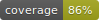

# Multilingual Customer Feedback Analyzer v1.0



## Project Summary

This project is a full-stack web application built to collect and analyze customer feedback for various products across multiple languages. It features a React frontend, a FastAPI backend, and a PostgreSQL database, all containerized with Docker. The core functionality leverages Google's Gemini AI to perform language detection, translation, and sentiment analysis on user submissions.

The application includes a complete admin workflow, allowing for the review, approval, and editing of specific feedback entries. The main view features a paginated display of results, a real-time dashboard with sentiment statistics, and a pie chart visualization. A CI pipeline using GitHub Actions automatically runs the backend test suite on every code push.

---

## Key Features

-   **AI-Powered Analysis**: Utilizes Google Gemini for language detection, translation, and sentiment analysis.
-   **Full-Stack Application**: Modern stack with a React frontend and a Python FastAPI backend.
-   **Containerized Environment**: Fully containerized with Docker Compose for easy setup and consistent deployment.
-   **Admin Dashboard**: Displays real-time sentiment statistics (positive, neutral, negative) and a pie chart visualization.
-   **Advanced Filtering**: Admins can filter the feedback list by product, sentiment, and language.
-   **Review & Approval Workflow**: Admins can review, manually translate/categorize, and approve feedback that the AI flags as nonsensical.
-   **Persistent Admin Login**: Admin state is saved in the browser's `localStorage` to persist across page reloads.
-   **Pagination**: The feedback list is paginated to efficiently handle a large number of entries.
-   **Automated CI Pipeline**: A GitHub Actions workflow automatically runs the backend test suite and updates a coverage badge on every push to the main branch.
-   **Responsive Design**: The UI adapts to smaller screen sizes for a better user experience on mobile devices.

---

## Technology Stack

-   **Backend**: FastAPI (Python), SQLAlchemy
-   **Frontend**: React, Chart.js (`react-chartjs-2`), Axios
-   **Database**: PostgreSQL
-   **AI Service**: Google Gemini
-   **Testing**: Pytest, Pytest-Mock, Pytest-Cov
-   **Language Processing**: Pycountry
-   **Containerization**: Docker & Docker Compose

---

## Getting Started (for Windows Users)

This guide assumes you are using Windows with WSL 2. This is the recommended setup for performance and reliability with Docker.

### 1. Prerequisites

-   **Docker Desktop**: Install it from the official [Docker website](https://www.docker.com/products/docker-desktop/).
-   **WSL 2 and Ubuntu**: Open PowerShell as an Administrator and run `wsl --install`. This will enable the necessary Windows features and install the default Ubuntu distribution.

### 2. Docker and WSL Integration

1.  Open **Docker Desktop**.
2.  Go to **Settings > Resources > WSL Integration**.
3.  Ensure the toggle is **ON** for your Ubuntu distribution and click **"Apply & Restart"**.

### 3. Project Setup

**CRITICAL**: For the live-reloading to work, your project files must be located **inside the WSL 2 filesystem**.

1.  Open Windows File Explorer and navigate to `\\wsl$`.
2.  Open your `Ubuntu` folder, then `home`, then your `<username>` folder.
3.  Copy the entire `feedback-analyzer` project folder into this location.

### 4. Permissions Setup

Open your **Ubuntu terminal** and navigate to your project folder.

```bash
cd ~/feedback-analyzer
```

Run the following commands to set the correct permissions:

```bash
# Take ownership of all project files
sudo chown -R $USER:$USER .

# Add your user to the 'docker' group to avoid permission errors
sudo usermod -aG docker $USER
```

**After running `usermod`, you must close and reopen your Ubuntu terminal for the change to take effect.**

### 5. Environment Configuration

Create a `.env` file in the root of the project (`~/feedback-analyzer/.env`). Add your Gemini API key to this file:

```
GEMINI_API_KEY=Your_Key_Goes_Here
```

---

## How to Run the Project

1.  Ensure Docker Desktop is running.
2.  Open your **Ubuntu terminal** and navigate to the project root directory.
    ```bash
    cd ~/feedback-analyzer
    ```
3.  Run the following command to build the images and start the containers:
    ```bash
    docker compose up --build
    ```

### Accessing the Application

-   **Frontend:** `http://localhost:3000`
-   **Backend API Docs (Swagger UI):** `http://localhost:8000/docs`
-   **Admin Access:** Click the "Admin Login" button and use the password `admin123`.

---

## API Routes and Usage

-   `POST /api/feedback`: Submits new feedback.
    -   **Body**: `{ "product": "string", "original_text": "string" }`
-   `GET /api/feedback`: Retrieves a paginated list of feedback.
    -   **Query Parameters**:
        -   `page=<integer>` (Default: 1)
        -   `page_size=<integer>` (Default: 5)
        -   `product=<string>`
        -   `sentiment=<string>`
        -   `original_language=<string>`
        -   `show_all=<boolean>` (for admins to see 'review' status items)
-   `GET /api/stats`: Retrieves a summary of feedback sentiment statistics.
-   `PUT /api/feedback/{feedback_id}`: Updates a feedback entry (used for the admin review process).
    -   **Body**: `{ "translated_text": "string", "sentiment": "string" }`
-   `DELETE /api/feedback/{feedback_id}`: Deletes a feedback entry.

---

## Limitations & Known Issues

-   The "Admin Mode" is a simple frontend implementation (password in code) for demonstration and is not a secure authentication system for a production environment.
-   Database schema changes during development require manually removing the Docker volume (`docker volume rm feedback-analyzer_postgres_data`) and restarting the application, which deletes all existing data. In a production setting, a migration tool like Alembic would be used.